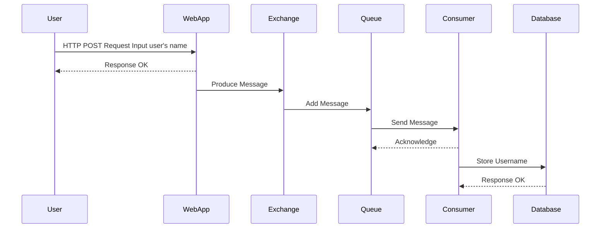

# Inria Task

This Repository contains Web Development Task to be completed as a part of the Inria selection Procedure.

## Progress
- Understanding and Roadmap:
  - [ ] https://github.com/azlaanmsamad/Inria_Task/issues/3 Write a small architecture document + diagram of the expected development workflow and deployment/target infrastructure.  
- Project Setup:
  - [x] Create a project on Github or Inria's Gitlab (depending on your familiarity with the platforms, or account availability).
- Web App Development:
  - [x] Web App with sensor data kept in memory in the backend and stored in database for backup.
  - [x] Display last 5 data points for each topic/queue with timestamps.
  - [x] `clear` REST API method that cleans all the data in the memory.
- Broker Integration:
  - [x] For message broker, messages of 3 different categories are received onto 3 different queues.
  - [x] Extend backend code with Docker integration
- Database Integration:
  - [x] Add database support (new feature branch).
  - [x] Write the data into the database.
- CI Setup:
  - [ ] https://github.com/azlaanmsamad/Inria_Task/issues/3  Not Priority.

## Problem Statement
- Develop a web app to receive 3 different signal inputted by the user and store it in the Database for backup. 
- Retreive the last 5 datapoints from the backend and display them with timestamps.
- Expose a REST API with a one method _clear_ that cleans all the data in the memory.
- Dockerizer the different functionalities.

## Sequence Diagram

## RabbitMQ

### RabbitMQ Docker Launch
1. Install `docker`
2. Open the terminal and go to the `rabbitmq/` directory.
3. Run `docker compose up` in the terminal.
4. Open the web browser and enter `http://localhost:15672` to get the login page.
5. Enter the username as `guest` and password as `guest` as well.

### RabbitMQ Understanding
- It contains three customised Queues namely: `sensor_1`, `sensor_2` and `sensor_3` to which 3 different data types are added.
- These data points when published has to pass through an exchanger which determines which data goes to which queue.
- In this case a `direct` exchanger is used so that a particular type of data is given only to its corresponding queue.
- RabbitMQ uses a `routing key` and `binding key`. The data is published along with the `routing key` which when (in `direct` case) exactly matches with the `binding key` of a queue, it is given to that particular queue.
- In this case, since 3 different data types need to be placed on 3 different queues, therefore 3 distinct `binding keys` were used.
- Routing keys and associated Queues:
  - `sensor_1` `-->` `first_sensor`
  - `sensor_2` `-->` `second_sensor`
  - `sensor_3` `-->` `third_sensor`

### RabbitMQ Usage:
1. After logging in the browser, click on `Exchanges` tab, and select `exchanger` from the list of exchanges.
2. Expand the `Bindings` drop down menu to see the different `queues` and associated `Routing key`.
3. Go to `Publish message` drop down and type the `Routing key` of the associated Queue.
4. Type the message you wish to send in the `Payload` section and finally click on `Publish message`. You will get a message published pop up window, close it.
5. Ideally, if you entered the `Routing key` for `sensor_1` the messgae should have been received by `sensor_1` only and no other queue since its a `direct` exchange.
6. To check this, go to the `Queues` tab select the `sensor_1` queue and expand the `Get messages` drop section and click on `Get Messages(s)` button.
7. The message in the `payload` should be the same as you sent in Step 4. And this message should not exist in other queues, repeat the steps 6-7 to confirm this.

## Flask Web App

### Web App Installation
1. First install all the requirements `pip install -r requirements.txt`
2. Execute the command `python run.py` in the terminal.
3. Open a web browser and go to `http://127.0.0.1:5000/`

### Web App Usage
1. After opening the browser a welcome page is displayed.
2. To add a user's name go to the Register tab and add the name. This will also store it in the in-memory database.
3. The top 5 most recent added Users can be checked by clicking the Users (In Memory) icon.
4. Finally, another REST API is used which clears all the data by clicking on Clear button.

## Technologies Used: 
Flask, RabbitMQ/Redis, SQLAlchemy 

## LICENSE
[MIT LICENSE](LICENSE.md)
